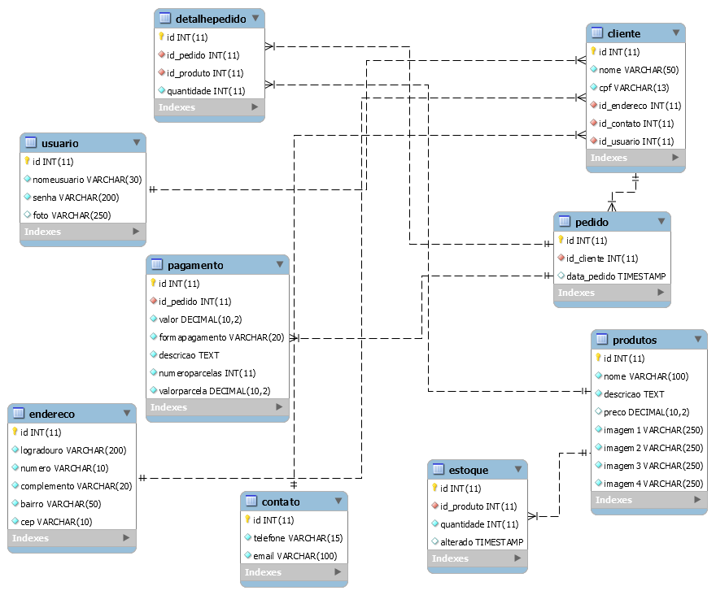

# Loja

O projeto loja é um __estudo__ de como construir, consumir e aplicar
uma API em [php](https://www.php.net/), com o uso de [IONIC](https://ionicframework.com/). Onde usamos o php para criar
a API com o padrão de desenvolvimento em camadas seguindo o paradigma
da programação orientada a objeto e gerando uma estrutura para consumo em JSON, ou seja, uma API REST.

Para banco de dados usamos o SGDB [MySql](https://www.mysql.com/) com 9 tabelas. Sendo estas:
Usuario, Contato, Endereco, Cliente, Produto, Estoque, Pedido, DetalhePedido, Pagamento.

Para consumo da APIfoi desenvolvido um App(aplicativo) em IONIC. 

## Tecnologias aplicadas ao projeto
[![NODE Version][node-image]][node-version-url]
[![NPM Version][npm-image]][npm-url]
[![MySql Version][mysql-image]][mysql-url]
[![PHP Version][php-image]][php-url]

### Instalação do NodeJS
Como um tempo de execução JavaScript assíncrono orientado a eventos, o Node.js foi projetado para criar aplicativos de rede escaláveis. No exemplo "olá mundo" a seguir, muitas conexões podem ser tratadas simultaneamente. Em cada conexão, o retorno de chamada é acionado, mas se não houver trabalho a ser feito, o Node.js entrará em suspensão.

#### Instalação no Windows
[Download do NODE JS](https://nodejs.org/en/download/)

#### Instalação no Linux Ubuntu
```bash 
sudo apt install nodejs
```

### Instalação do IONIC
O Ionic Framework é um kit de ferramentas de interface do usuário de código aberto para a criação de aplicativos móveis e de desktop de alto desempenho e desempenho, usando tecnologias da web (HTML, CSS e JavaScript).

O Ionic Framework concentra-se na experiência do usuário front-end ou na interação da interface do usuário de um aplicativo (controles, interações, gestos, animações). É fácil de aprender e integra-se perfeitamente a outras bibliotecas ou estruturas, como Angular, ou pode ser usado de forma independente sem uma estrutura de front-end usando um script simples.
#### Comando para instalar
```bash
npm install -g ionic
```
### Banco de Dados MySql
Abaixo é apresentado o diagrama de banco de dados desenvolvido para esse projeto.



## Work Flow do APP
